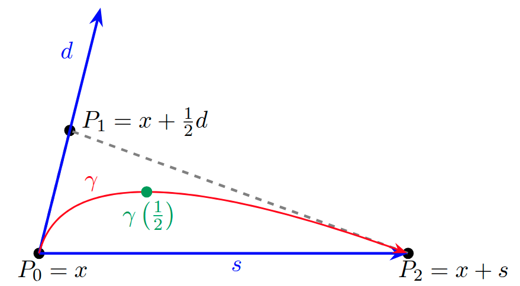

[](https://www.python.org/downloads/release/python-3100/)
[](https://opensource.org/licenses/Apache-2.0)

<p>
  
</p>

## Efficient globalization of heavy-ball type methods for unconstrained optimization based on curve searches

Implementation of the CS methdology proposed in 

[Donnini, F., Lapucci, M. & Mansueto, P., Efficient globalization of heavy-ball type methods for unconstrained optimization based on curve searches. arXiv pre-print (2025)]()

If you have used our code for research purposes, please cite the publication mentioned above.
For the sake of simplicity, we provide the Bibtex format:

```
TODO
```

### Main Dependencies Installation

In order to execute the code, you need an [Anaconda](https://www.anaconda.com/) environment with Python>=3.10.

For the packages installation, open a terminal (Anaconda Prompt for Windows users) in the project root folder and execute the following commands.

```
pip install tabulate
pip install pycutest
pip install psutil
```

##### Cutest Collection

In order to run the code, the [Cutest](https://github.com/ralna/CUTEst) Collection needs to be installed, as well as [PyCutest](https://github.com/jfowkes/pycutest) in the Anaconda environment.

### Usage

In ```parser_management.py``` you can find all the possible arguments. Given a terminal (Anaconda Prompt for Windows users), an example of execution could be the following.

``` python main.py --problem HILBERTB DECONVB MANCINO --g_factor 0.125 0.2 --M_nm 0 5 --save_logs Exp_Results```

### Contact

If you have any question, feel free to contact us:

Federica Donnini, [Pierluigi Mansueto](https://webgol.dinfo.unifi.it/pierluigi-mansueto/)<br>
Global Optimization Laboratory ([GOL](https://webgol.dinfo.unifi.it/))<br>
University of Florence<br>
Email: federica dot donnini at unifi dot it, pierluigi dot mansueto at unifi dot it